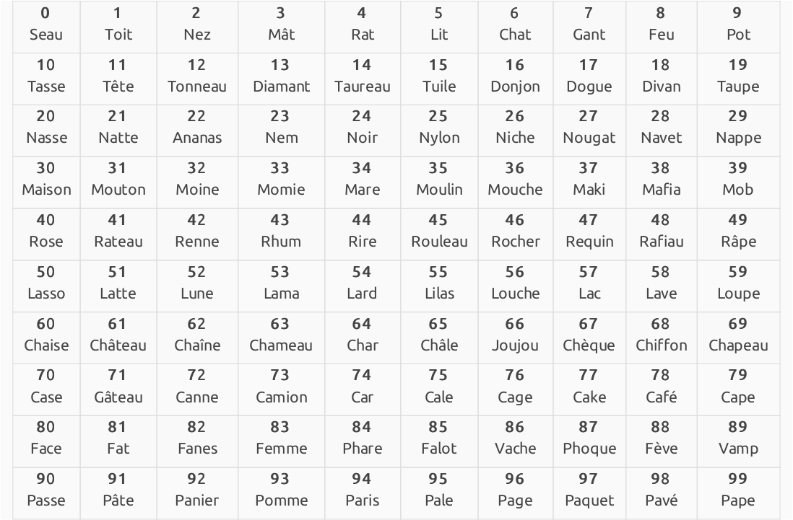
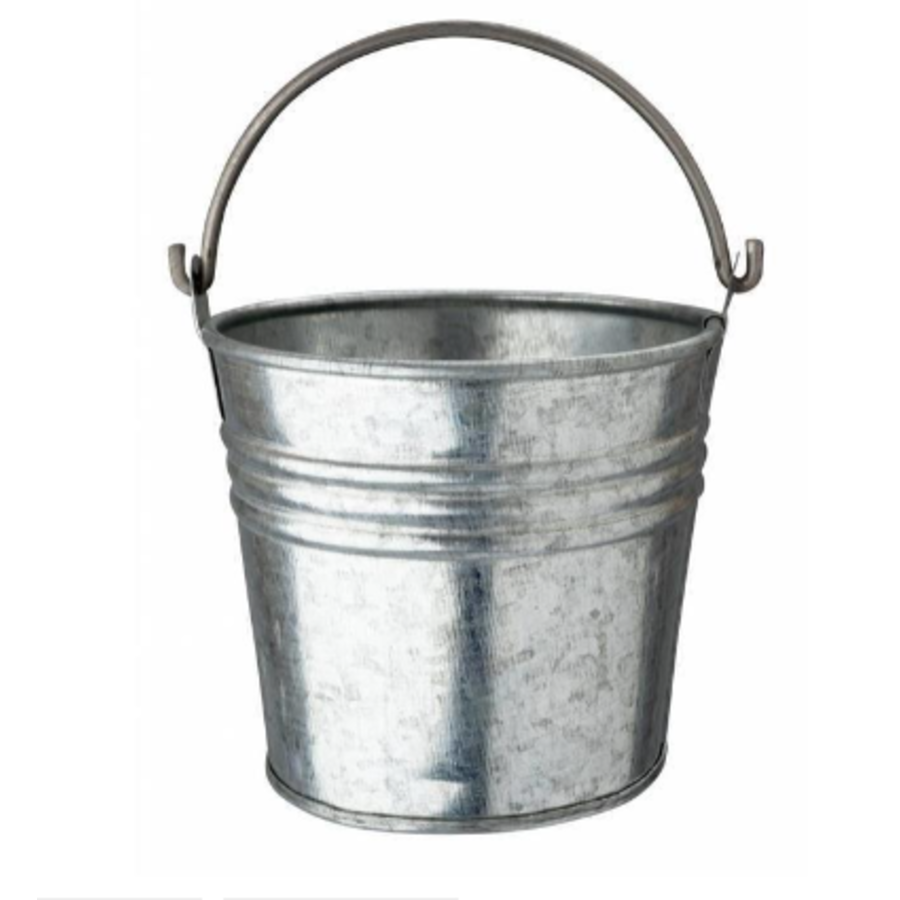
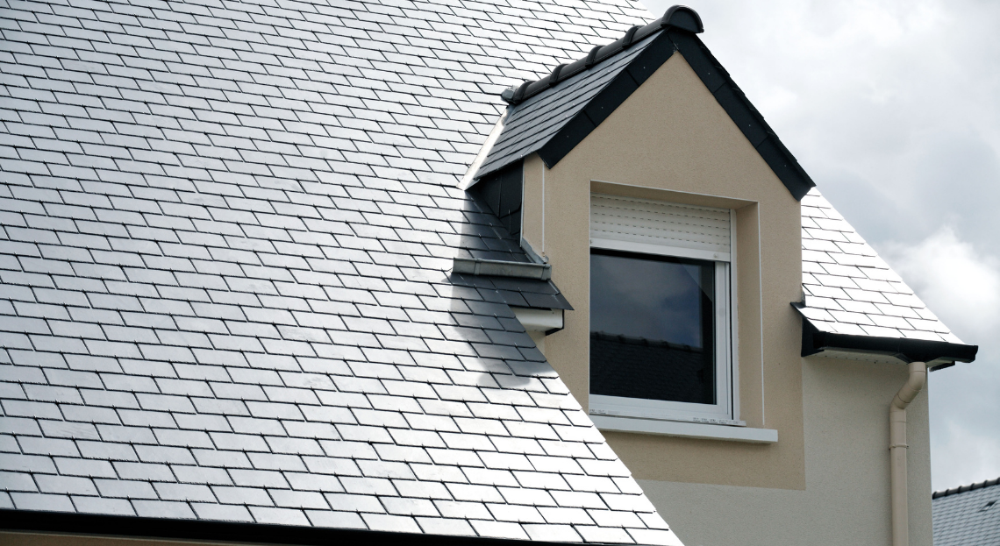
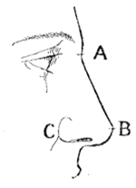
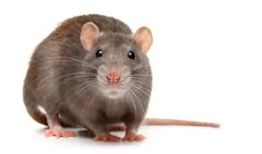
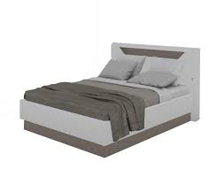
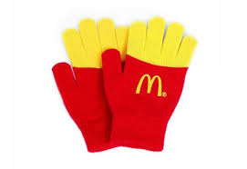
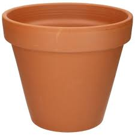

---

date: 2022-09-18T12:10
tags:
  - memoire/nombre/major-system

---

# Major system

## Implémentation en francais

Reference
- https://jeretiens.net/systeme-major-de-memorisation/

## Mapping chiffre/lettre

`0` Seau 
: S, Z, C. Z est la première lettre de zéro. Les autres lettres ont un son similaire.

---

`1` Toit 
: T, D. T et D ont un coup de descente dans la prononciation et un son similaire (certains systèmes et variantes incluent « th »). 

---

`2` Nez 
: N. La lettre N a deux pentes lorsqu’on le trace et ressemble à « 2 » sur le côté. 

---

`3` Mat 
: M.M a trois pentes lorsqu’on le trace et ressemble à un 3 sur le côté. 

---

`4` Rat 
: R. Dernière consonne de quatre, également 4 et R sont presque des images en miroir l’une de l’autre. 

---

`5` Lit 
: L. L est le chiffre romain pour 50. 

---

`6` Chat 
: SH, CH, J, G, ZH. La graphie de j et de g ressemblent au 6. 

---

`7` Gant 
: K, C, G, Q. K « contient » deux sept (de manière imagée). 

---

`8` Feu 
: F, V. La lettre F ressemble au chiffre 8. V sonne de la même façon. 

---

`9` Pot 
: P, B. P est une image miroir 9. B sonne de la même façon et ressemble à deux 9 enroulés.

---

